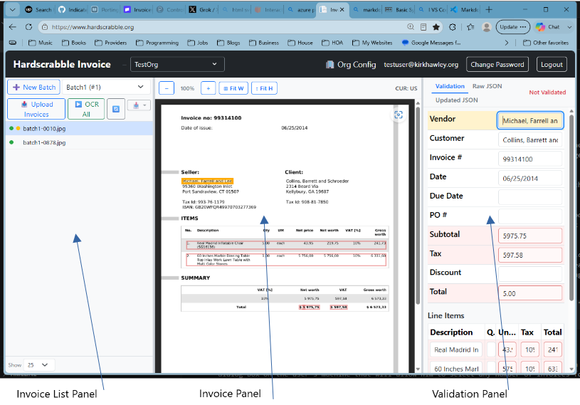
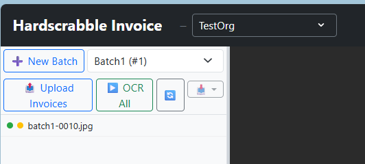

# Hardscrabble Invoice

Hardscrabble Invoice is an invoice management app. Its purpose is to allow the user to upload invoices, OCR them to get the important field values for both normal invoice fields and line items, and give the user a usable edit-and-validation user interface that automatically identifies possible inaccuracies. It then exports the validated data to JSON or Excel files.

## Features
- Upload invoices - Add PDFs or images to a batch and keep related invoices together.
- Review OCR results - Check extracted fields, validate totals, and correct issues before export.
- Export batch data - Move finished work into JSON or Excel for downstream processing.
- Supported Invoice Files - pdf, jpg, png

## Limits:
**User Limits:**
Batches: Unlimited
Invoices per Batch: 100 
Pages per Invoice: 20

**Guest User Limits:**
Batches: 2
Invoices per Batch: 20
Pages Per Invoice: 20

**Beta User Limits:**
Max OCRed Pages: 500

## UI Panels:

**The Invoice List Panel** contains a Batch selector, a list of the Invoices in the Batch, and some buttons to select batches. Selecting an Invoice by clicking it in the list displays the Invoice in the Invoice Panel.

**The Invoice Panel** is where the Invoice is displayed. 

**The Validation Panel** is where the OCR data for the displayed Invoice can be inspected for errors. It has 3 tabs:
- Validation - this is where the user can see and edit the OCR data.
- Raw JSON - This is the raw data returned by the OCR process.
- Updated JSON - This is the edited data. When the OCR data is edited and validated, the finished text will be displayed here. This is the data that will be exported.

## Batches:

This image shows one batch containing one Invoice. There are two dots to the left of the invoice name. The green dot indicates that the invoice uploaded successfully. The orange dot indicates that the invoice has not yet been approved.

Invoices are processed in batches. An organization has a list of its batches. Each batch will contain multiple images. 

**Uploading Invoices:** Usually a user will create a batch, upload multiple invoices (pdf, jpg, or png files) to the batch. Successfully uploaded files will have a green dot next to them. 

**OCRing Invoices:** Once the upload is done, the batch can be submitted for OCR by clicking the "OCR All" button - the batch will be sent to the OCR Queue, and a red "Q" will appear to the left of each invoice name. The OCR will take place in the background. When each image has finished processing, the red "Q" will be replaced by an orange dot. 

Single invoices can be OCRed (or re-OCRed) by right-clicking the invoice and selecting "Run OCR". For Invoices that have not been OCRed, there is also a "Run OCR" button in the Validation panel.

**The OCR Process:**
Hardscrabble Invoice employs a 2-step OCR process. The main process uses Azure Document Intelligence to OCR the invoice. The secondary process employs a local OCR solution that runs while Azure Document Intelligence process the invoice. 

**Invoice Queuing:** Hardscrabble Invoice runs a processing queue that accepts Batch OCR jobs. These jobs are run in succession. This may take some time. When the job is done, the orange dot in the Invoice List on the Invoices that were successfully OCRed are changed to green dots.

**Upload Process:**
After a batch is created and/or selected, clicking the Upload Invoices button will open a dialog box on the user's machine that will allow him to select any number of invoices for upload to that batch.

**Automatic Error Checks:**
When both OCR process are done, the results are compared an analyzed for several types of errors:
	1. Azure Document Intelligence Field Confidence
	2. Secondary OCR Field Confidence
	3. Per-field mismatches between the two OCR results
	4. Math errors in line items.
	5. Math errors in invoice total.

**Validation:** As the user tabs through the fields in the validation panel, the corresponding field is highlighted on the invoice image. If the user clicks on a particular field in either window, the corresponding field is highlighted in the other window. 

Also, if the user clicks on an OCRed field in the Invoice panel, the corresponding field will be highlighted in the Validation panel.

There are several ways Hardscrabble Invoice tries to identify problem fields:
- OCR confidence as returned by Azure Document Intelligence and the secondary OCR.
- Checking that the two OCR process get the same value.
- Checking that the math for line item totals and the invoice total is correct.

Possible errors that have been identified by the automatic validation are marked in red. **This does not mean that the OCR result is incorrect** - just that confidence in that field is low, for one or more of the reasons listed above. When the user verifies that the OCR result doesn't match what he sees on the scanned invoice, he can edit the value.

The user can save his changes at any time by clicking on the Save button at the bottom of the edit form. When satisfied that the results are correct, the user can accept them by clicking on the Accept button. This causes the orange button to the left of the Invoice name in the Invoice List Panel to change to green. Notr that if the user spots an error, he can still make changes and save them for an Accepted Invoice.

The user can simply click the Accept button if all fields look correct.

When the user hovers over a field, a tooltip will appear. This will contain, at a minimum, the field value. If any possible errors are found, the user will also see the reasons in red.

**Invoice Download:**
Once all Invoices in a Batch have been accepted for validation, the Export Batch button in the Invoice List toobar becomes enabled. The user will see a menu with "Export to JSON" and "Export to Excel" menu items. Clicking either of these buttons will open a dialog that will allow selecting a folder for the file to be written too, and naming the new file. 

NOTE: The organization admin can disable the requirement that all Invoices in the Batch have to be accepted before export.

**Batch Deletion**
When a batch has been validated and uploaded to the customer, the batch is marked for deletion. The batch will be permanently deleted 14 days after it is marked for deletion.

**Organization Deletion**
When Organizations are deleted, the organization data is retained for 2 weeks. During that period, it is possible to reactivate the Organization by contacting Hardscrabble. When the retention period is over, the Organization and all of its data will be physically and permanently deleted.

**User Management**
Deleting one org removes that org’s memberships; the user account stays as long as they have at least one remaining membership.